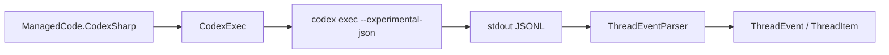

# ADR 001: Use Codex CLI as SDK Transport

- Status: Accepted
- Date: 2026-03-05

## Context

The TypeScript source SDK for Codex is CLI-oriented and communicates via `codex exec --experimental-json` with JSONL events.
To keep behavior parity and reduce protocol drift, this .NET SDK needs a transport strategy aligned with upstream behavior.

## Decision

Use the local Codex CLI process as the only runtime transport layer for `ManagedCode.CodexSharp`.

- `CodexExec` builds argument order and environment variables.
- `DefaultCodexProcessRunner` starts process and streams stdout lines asynchronously.
- `ThreadEventParser` maps JSONL protocol to strongly typed events and items.

## Diagram

## Consequences

### Positive

- High parity with upstream TypeScript behavior.
- No separate protocol server to maintain.
- Easy compatibility when Codex CLI adds flags/events.

### Negative

- Requires `codex` binary availability in environment.
- Runtime errors may come from external process failures.

### Neutral

- SDK remains process-boundary integration; pure in-memory simulation is test-only via fake runner.

## Alternatives considered

- Direct HTTP protocol implementation: rejected due drift risk and higher maintenance.
- TCP/daemon transport abstraction now: deferred; may be revisited if CLI introduces stable server mode.
