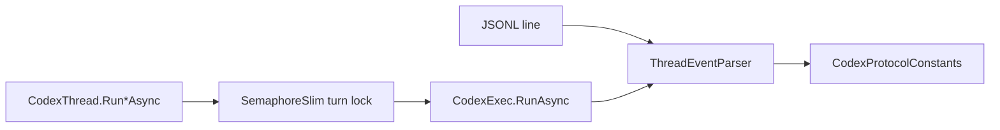

# ADR 002: Explicit Protocol Constants and Serialized Per-CodexThread Turns

- Status: Accepted
- Date: 2026-03-05

## Context

Codex CLI emits dynamic JSONL events (`thread.started`, `item.completed`, etc.).
Without strict parsing rules and synchronized turn execution, SDK behavior can diverge under concurrency and protocol evolution.
User rule in this repository explicitly forbids inline string literals for protocol token matching.

## Decision

1. Centralize protocol tokens in `CodexProtocolConstants`.
2. Parse events/items only through constant-based switches.
3. Serialize execution per `CodexThread` instance with `SemaphoreSlim`.

## Diagram

## Consequences

### Positive

- No magic literals in parser logic.
- Safer maintenance when protocol tokens change.
- Eliminates race conditions for same thread instance.

### Negative

- Additional constants maintenance when upstream adds new token names.

### Neutral

- Multi-thread concurrency is still allowed across different `CodexThread` instances.

## Alternatives considered

- Keep inline string literals: rejected by project rule and maintainability concerns.
- Lock-free per-thread execution: rejected due shared thread state (`thread_id`, event stream aggregation).
