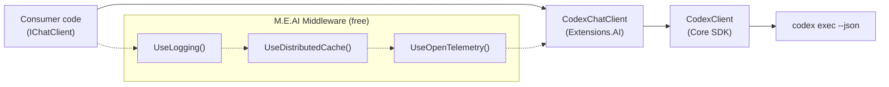

# ADR 003: Microsoft.Extensions.AI Integration

- Status: Accepted
- Date: 2026-03-05

## Context

CodexSharpSDK wraps the Codex CLI with a bespoke API surface (`CodexClient`/`CodexThread`/`RunResult`). The .NET ecosystem has standardized on `Microsoft.Extensions.AI` abstractions (`IChatClient`) for provider-agnostic AI integration with composable middleware pipelines.

## Decision

Implement `IChatClient` from `Microsoft.Extensions.AI.Abstractions` in a **separate NuGet package** (`ManagedCode.CodexSharpSDK.Extensions.AI`) that adapts the existing SDK types without modifying the core SDK.

### Key design choices

1. **Separate package** — Core SDK remains M.E.AI-free. The adapter is opt-in, following the pattern of `Microsoft.Extensions.AI.OpenAI` being separate from `OpenAI`.

2. **Custom AIContent types** — Rich Codex items (command execution, file changes, MCP tool calls, web searches, multi-agent collaboration) are surfaced as typed `AIContent` subclasses rather than being flattened to text. This preserves full fidelity of Codex output.

3. **Codex-specific options via AdditionalProperties** — Standard `ChatOptions` properties (`ModelId`, `ConversationId`) map directly. Codex-unique features use `codex:*` prefixed keys in `ChatOptions.AdditionalProperties` (e.g., `codex:sandbox_mode`, `codex:reasoning_effort`).

4. **Thread-per-call with ConversationId resume** — Each `GetResponseAsync` call creates or resumes a `CodexThread`. Thread ID flows via `ChatResponse.ConversationId` for multi-turn continuity.

5. **No AITool support** — Codex CLI manages tools internally (commands, file changes, MCP). Consumer-registered `ChatOptions.Tools` are ignored; tool results surface as custom `AIContent` types instead.

## Diagram

## Consequences

### Positive

- SDK participates in .NET AI ecosystem: DI registration, middleware pipelines, provider swapping.
- Consumers get logging, caching, and telemetry for free via M.E.AI middleware.
- Rich Codex items preserved as typed content, not lost.

### Negative

- Impedance mismatch: Codex is an agentic coding tool, not a simple chat API. Multi-turn via message history doesn't map cleanly (uses thread resume instead).
- No temperature/topP/topK (Codex uses `ModelReasoningEffort`).
- Streaming is item-level, not token-level.

### Neutral

- Additional NuGet package to maintain.
- `ChatOptions.Tools` is a no-op; documented as limitation.

## Alternatives considered

- Implement `IChatClient` directly in core SDK: rejected to avoid mandatory M.E.AI dependency.
- Flatten all Codex items to `TextContent`: rejected to preserve rich output fidelity.
- Map Codex commands/file changes as `FunctionCallContent`: rejected because tools are internal to CLI, not consumer-invocable.
