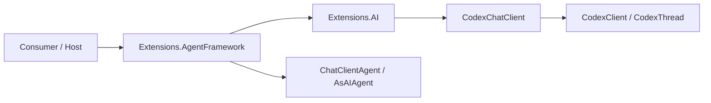

# ADR 004: Microsoft Agent Framework Integration

- Status: Accepted
- Date: 2026-03-16

## Implementation plan (step-by-step)

- [x] Analyze current state (facts)
- [x] Plan the change (steps, files/modules, tests, docs)
- [x] Implement the change (smallest safe increments)
- [x] Add/update automated tests (happy + negative + edge; protect invariants)
- [x] Run verification commands (build/test/format/analyze/coverage) and record results
- [x] Update docs (ADR/Features/Architecture overview) and close the checklist

## Context

CodexSharpSDK already exposes `ManagedCode.CodexSharpSDK.Extensions.AI`, which adapts the Codex CLI runtime to `Microsoft.Extensions.AI` through `CodexChatClient : IChatClient`. Microsoft Agent Framework provides a general `IChatClient.AsAIAgent(...)` path plus provider-specific bridge packages such as `Microsoft.Agents.AI.GitHub.Copilot` for backends that do not implement `IChatClient`.

The user request is to support Microsoft Agent Framework usage in this repository with an experience comparable to the GitHub Copilot provider docs, while staying aligned with the architecture already present here.

Goals:

- enable Codex-backed `AIAgent` usage with documented, supported package boundaries
- keep the existing core SDK and M.E.AI adapter modular
- provide DI convenience for `AIAgent` registration without inventing a parallel agent runtime

Non-goals:

- implementing a custom `AIAgent` runtime like the GitHub Copilot provider
- adding MAF hosting/workflow packages or durable orchestration support
- changing core `CodexClient` / `CodexThread` behaviour

## Decision

Implement Microsoft Agent Framework support as a separate opt-in package, `ManagedCode.CodexSharpSDK.Extensions.AgentFramework`, that composes the existing `CodexChatClient` with `Microsoft.Agents.AI` `ChatClientAgent`/`AsAIAgent(...)` and provides DI registration helpers.

Key points:

1. Keep MAF dependency out of core SDK and out of `ManagedCode.CodexSharpSDK.Extensions.AI`.
2. Reuse the existing `IChatClient` adapter instead of creating a bespoke Codex-specific `AIAgent`.
3. Expose DI helpers for both non-keyed and keyed `AIAgent` registration to make the integration first-class for host applications.
4. Keep the package itself on a prerelease version track while `Microsoft.Agents.AI` is prerelease so NuGet packaging remains valid.

## Diagram

## Alternatives considered

### Add `Microsoft.Agents.AI` directly to `ManagedCode.CodexSharpSDK.Extensions.AI`

- Pros:
  - fewer packages for consumers
  - no extra adapter project
- Cons:
  - forces MAF dependency onto every `IChatClient` consumer
  - mixes two different integration boundaries into one package
- Rejected because the repository already treats ecosystem adapters as opt-in boundaries.

### Implement a custom `CodexAIAgent` class

- Pros:
  - would look similar to `GitHubCopilotAgent`
  - full control over session behaviour
- Cons:
  - duplicates functionality already provided by `ChatClientAgent`
  - increases maintenance and behavioural drift risk
- Rejected because Codex already exposes the canonical `IChatClient` abstraction required by MAF.

### Document manual `AsAIAgent(...)` usage only

- Pros:
  - smallest code change
  - no new package
- Cons:
  - no first-class DI helpers
  - no explicit repository boundary for MAF support
- Rejected because the user asked to make the integration available "у нас", not just possible in consumer code.

## Consequences

### Positive

- Preserves a clean dependency ladder: core SDK -> M.E.AI adapter -> MAF adapter.
- Aligns with the official Microsoft pattern of separate bridge packages for agent-framework integrations.
- Gives consumers a documented one-package path for MAF registration while keeping direct `AsAIAgent(...)` usage intact.

### Negative / risks

- Adds one more optional NuGet package to maintain.
- Introduces a preview/RC ecosystem dependency surface from Microsoft Agent Framework.
- Full solution tests remain influenced by local real-CLI environment and may still fail outside this change.

Mitigation:

- keep the integration thin and DI-focused
- verify published dependency version from official NuGet before pinning
- cover the new layer with DI unit tests instead of new auth-dependent integration tests

## Impact

### Code

- Affected modules / services:
  - `CodexSharpSDK.Extensions.AgentFramework`
  - `CodexSharpSDK.Tests`
  - documentation under `README.md`, `docs/Features`, `docs/ADR`, `docs/Architecture`, `docs/Development`
- New boundaries / responsibilities:
  - new MAF adapter package responsible only for `AIAgent` composition and DI

### Data / configuration

- New config keys: none
- Backwards compatibility strategy:
  - existing packages remain usable without MAF
  - new package is additive and opt-in

### Documentation

- Feature docs to update: `docs/Features/agent-framework-integration.md`
- Architecture docs to update: `docs/Architecture/Overview.md`
- Development docs to update: `docs/Development/setup.md`
- README to update with public examples and package installation

## Verification

### Objectives

- Prove that the new package registers `AIAgent` and `IChatClient` together.
- Prove that agent options and Codex chat metadata propagate through the MAF layer.
- Prove that keyed registration works the same way as non-keyed registration.

### Test commands

- build: `dotnet build ManagedCode.CodexSharpSDK.slnx -c Release -warnaserror`
- test: `dotnet test --solution ManagedCode.CodexSharpSDK.slnx -c Release`
- format: `dotnet format ManagedCode.CodexSharpSDK.slnx`
- coverage: `dotnet test --solution ManagedCode.CodexSharpSDK.slnx -c Release -- --coverage --coverage-output-format cobertura --coverage-output coverage.cobertura.xml`

### New or changed tests

| ID | Scenario | Level | Expected result | Notes |
| --- | --- | --- | --- | --- |
| TST-AGENT-001 | Register non-keyed `AIAgent` | Unit | `AIAgent` and `IChatClient` both resolve | `CodexAgentServiceCollectionExtensionsTests.AddCodexAIAgent_RegistersAIAgentAndChatClient` |
| TST-AGENT-002 | Apply non-keyed agent options | Unit | name, description, instructions, default model preserved | `CodexAgentServiceCollectionExtensionsTests.AddCodexAIAgent_WithConfiguration_AppliesAgentOptions` |
| TST-AGENT-003 | Register keyed `AIAgent` | Unit | keyed agent and keyed chat client both resolve | `CodexAgentServiceCollectionExtensionsTests.AddKeyedCodexAIAgent_RegistersKeyedAgent` |
| TST-AGENT-004 | Apply keyed agent options | Unit | keyed instructions and default model preserved | `CodexAgentServiceCollectionExtensionsTests.AddKeyedCodexAIAgent_WithConfiguration_AppliesKeyedAgentOptions` |

### Verification results

- `dotnet build ManagedCode.CodexSharpSDK.slnx -c Release -warnaserror` — passes
- focused agent-framework tests — planned from the new test file above
- `dotnet test --solution ManagedCode.CodexSharpSDK.slnx -c Release` — expected to continue surfacing pre-existing real Codex CLI/MCP handshake issues in this environment; record actual result when run
- `dotnet format ManagedCode.CodexSharpSDK.slnx` — required before completion

## Rollout and migration

- Migration steps:
  - consumers that want MAF install `ManagedCode.CodexSharpSDK.Extensions.AgentFramework` as a prerelease package
  - optionally continue using `CodexChatClient` directly with `AsAIAgent(...)`
- Backwards compatibility:
  - no breaking changes to existing public APIs
- Rollback:
  - remove the new package and docs if MAF dependency proves unsuitable

## References

- Feature spec: `docs/Features/agent-framework-integration.md`
- M.E.AI base layer: `docs/ADR/003-microsoft-extensions-ai-integration.md`
- Official docs: `https://learn.microsoft.com/en-us/agent-framework/agents/providers/github-copilot?pivots=programming-language-csharp`
- Reference implementation: `https://github.com/microsoft/agent-framework`
