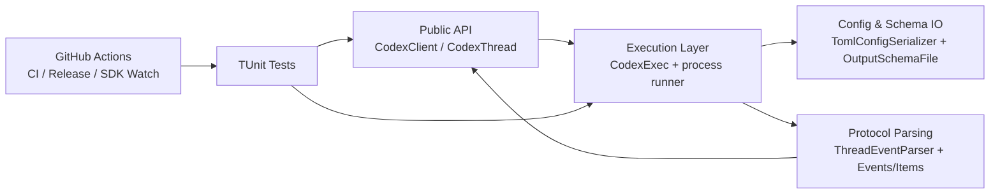
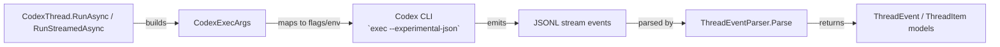
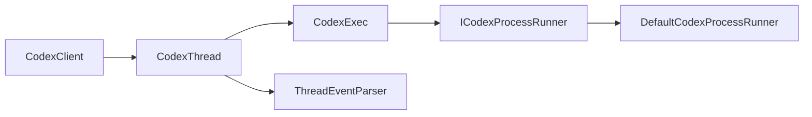

# Architecture Overview

Goal: understand quickly what exists in `ManagedCode.CodexSharp`, where it lives, and how modules interact.

Single source of truth: this file is navigational and coarse. Detailed behavior lives in `docs/Features/*`. Architectural rationale lives in `docs/ADR/*`.

## Summary

- **System:** .NET SDK wrapper over Codex CLI JSONL protocol.
- **Where is the code:** `src/CodexSharp`, tests in `tests/CodexSharp.Tests`, sample in `samples/CodexSharp.AotSmoke`.
- **Entry points:** `CodexClient`.
- **Dependencies:** local `codex` CLI process, `System.Text.Json`, .NET SDK/toolchain, GitHub Actions.

## Scoping (read first)

- **In scope:** SDK API surface, CLI argument mapping, event parsing, thread lifecycle, docs, tests, CI workflows.
- **Out of scope:** Codex CLI internals (`submodules/openai-codex`), non-.NET SDKs, infrastructure outside this repository.
- Start by mapping the request to a module below, then follow linked feature/ADR docs.

## 1) Diagrams

### 1.1 System / module map

### 1.2 Interfaces / contracts map

### 1.3 Key classes / types map

## 2) Navigation index

### 2.1 Modules

- `Public API` — code: [CodexClient.cs](../../src/CodexSharp/CodexClient.cs), [CodexThread.cs](../../src/CodexSharp/CodexThread.cs); docs: [thread-run-flow.md](../Features/thread-run-flow.md)
- `Execution Layer` — code: [CodexExec.cs](../../src/CodexSharp/CodexExec.cs), [CodexExecArgs.cs](../../src/CodexSharp/CodexExecArgs.cs)
- `Protocol Parsing` — code: [ThreadEventParser.cs](../../src/CodexSharp/Internal/ThreadEventParser.cs), [CodexProtocolConstants.cs](../../src/CodexSharp/Internal/CodexProtocolConstants.cs), [Events.cs](../../src/CodexSharp/Events.cs), [Items.cs](../../src/CodexSharp/Items.cs)
- `Config & Schema IO` — code: [TomlConfigSerializer.cs](../../src/CodexSharp/Internal/TomlConfigSerializer.cs), [OutputSchemaFile.cs](../../src/CodexSharp/Internal/OutputSchemaFile.cs)
- `Testing` — code: [tests/CodexSharp.Tests](../../tests/CodexSharp.Tests); docs: [strategy.md](../Testing/strategy.md)
- `Automation` — workflows: [.github/workflows](../../.github/workflows); docs: [release-and-sync-automation.md](../Features/release-and-sync-automation.md)

### 2.2 Interfaces / contracts

- `Codex CLI invocation contract` — source: [CodexExec.cs](../../src/CodexSharp/CodexExec.cs); producer: `CodexExec`; consumer: local `codex` binary; rationale: [001-codex-cli-wrapper.md](../ADR/001-codex-cli-wrapper.md)
- `JSONL thread event contract` — source: [ThreadEventParser.cs](../../src/CodexSharp/Internal/ThreadEventParser.cs); producer: Codex CLI; consumer: `CodexThread`; rationale: [002-protocol-parsing-and-thread-serialization.md](../ADR/002-protocol-parsing-and-thread-serialization.md)

### 2.3 Key classes / types

- `CodexClient` — [CodexClient.cs](../../src/CodexSharp/CodexClient.cs)
- `CodexThread` — [CodexThread.cs](../../src/CodexSharp/CodexThread.cs)
- `CodexExec` — [CodexExec.cs](../../src/CodexSharp/CodexExec.cs)
- `ThreadEventParser` — [ThreadEventParser.cs](../../src/CodexSharp/Internal/ThreadEventParser.cs)
- `CodexProtocolConstants` — [CodexProtocolConstants.cs](../../src/CodexSharp/Internal/CodexProtocolConstants.cs)

## 3) Dependency rules

- Allowed dependencies:
  - `tests/*` -> `src/*`
  - `samples/*` -> `src/*`
  - Public API (`CodexClient`, `CodexThread`) -> internal execution/parsing helpers.
- Forbidden dependencies:
  - No dependency from `src/*` to `tests/*` or `samples/*`.
  - No runtime dependency on `submodules/openai-codex`; submodule is reference-only.
- Integration style:
  - sync configuration + async process stream consumption (`IAsyncEnumerable<string>`)
  - JSONL event protocol parsing and mapping to strongly-typed C# models.

## 4) Key decisions (ADRs)

- [001-codex-cli-wrapper.md](../ADR/001-codex-cli-wrapper.md) — wrap Codex CLI process as SDK transport.
- [002-protocol-parsing-and-thread-serialization.md](../ADR/002-protocol-parsing-and-thread-serialization.md) — explicit protocol constants and serialized per-thread turn execution.

## 5) Where to go next

- Features: [docs/Features/](../Features/)
- Decisions: [docs/ADR/](../ADR/)
- Testing: [docs/Testing/strategy.md](../Testing/strategy.md)
- Development setup: [docs/Development/setup.md](../Development/setup.md)
