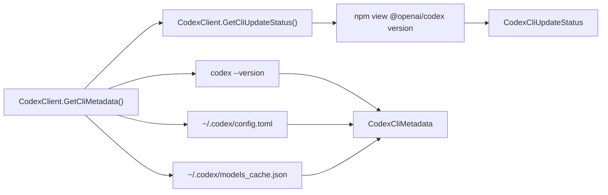

# Feature: Codex CLI Metadata

Links:
Architecture: [docs/Architecture/Overview.md](../Architecture/Overview.md)
Modules: [CodexClient.cs](../../CodexSharpSDK/Client/CodexClient.cs), [CodexCliMetadataReader.cs](../../CodexSharpSDK/Internal/CodexCliMetadataReader.cs), [CodexCliMetadata.cs](../../CodexSharpSDK/Models/CodexCliMetadata.cs)
Source of truth: local `codex` CLI + upstream npm package metadata (`@openai/codex`)

---

## Purpose

Expose runtime Codex CLI metadata to SDK consumers:

- installed `codex-cli` version
- default model configured in local Codex config
- local model catalog currently cached by Codex CLI
- update availability status vs latest published npm `@openai/codex` version

---

## Scope

### In scope

- `CodexClient.GetCliMetadata()` public API.
- `CodexClient.GetCliUpdateStatus()` public API.
- Reading version from `codex --version`.
- Reading default model from `~/.codex/config.toml`.
- Reading model catalog from `~/.codex/models_cache.json`.
- Reading latest published package version from `npm view @openai/codex version`.
- Returning package-manager-appropriate update command (`bun` or `npm`) in update status.

### Out of scope

- Remote model discovery over network APIs.
- Mutating user Codex config files.
- Replacing Codex CLI model selection logic.

---

## Business Rules

- Metadata read is read-only and does not mutate local Codex state.
- If thread-level web search settings are not specified, SDK does not emit `web_search` overrides.
- SDK option and metadata decisions are based on real Codex CLI behavior, not TypeScript SDK surface.
- Update check failures (for example missing `npm`) must return actionable status messages and never silently fail.
- Update command text must not assume npm-only installs; SDK must emit `bun` update command when bun-managed install is detected.

---

## Diagram

---

## Verification

- Unit parsing/update-check coverage: [CodexCliMetadataReaderTests.cs](../../CodexSharpSDK.Tests/Unit/CodexCliMetadataReaderTests.cs)
- CLI arg behavior: [CodexExecTests.cs](../../CodexSharpSDK.Tests/Unit/CodexExecTests.cs)
