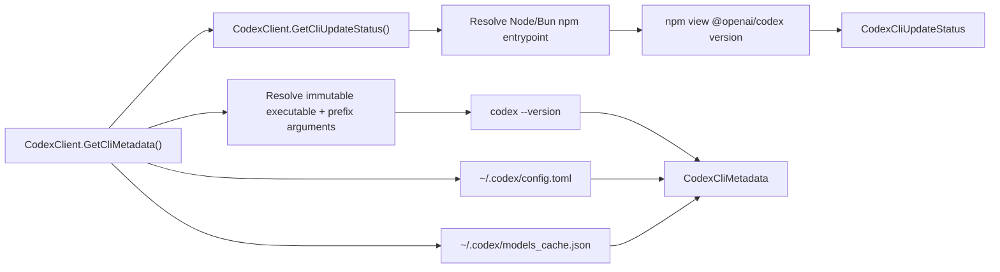

# Feature: Codex CLI Metadata

Links:
Architecture: [docs/Architecture/Overview.md](../Architecture/Overview.md)
Modules: [CodexClient.cs](../../CodexSharpSDK/Client/CodexClient.cs), [CodexCliMetadataReader.cs](../../CodexSharpSDK/Internal/CodexCliMetadataReader.cs), [CodexCliMetadata.cs](../../CodexSharpSDK/Models/CodexCliMetadata.cs)
Source of truth: local `codex` CLI + upstream npm package metadata (`@openai/codex`)

---

## Purpose

The SDK package version mirrors the targeted Codex CLI version in its first three numeric components and uses the fourth component for an SDK hotfix. `CodexCliCompatibility.TargetVersion` exposes the exact compatible CLI target without starting a process. `GetCliUpdateStatus()` separately reports the latest version discovered from npm.

Expose runtime Codex CLI metadata to SDK consumers:

- installed `codex-cli` version
- default model configured in local Codex config
- local model catalog currently cached by Codex CLI
- update availability status vs latest published npm `@openai/codex` version

---

## Scope

### In scope

- `CodexClient.GetCliMetadata()` public API.
- `CodexClient.GetCliUpdateStatus()` public API.
- Reading version from `codex --version`.
- Reading default model from `~/.codex/config.toml`.
- Reading model catalog from `~/.codex/models_cache.json`.
- Reading latest published package version from `npm view @openai/codex version`.
- Returning package-manager-appropriate update command (`bun` or `npm`) in update status.

### Out of scope

- Remote model discovery over network APIs.
- Mutating user Codex config files.
- Replacing Codex CLI model selection logic.

---

## Business Rules

- Metadata read is read-only and does not mutate local Codex state.
- If thread-level web search settings are not specified, SDK does not emit `web_search` overrides.
- SDK option and metadata decisions are based on real Codex CLI behavior, not TypeScript SDK surface.
- Update check failures (for example missing `npm`) must return actionable status messages and never silently fail.
- Update command text must not assume npm-only installs; SDK must emit `bun` update command when bun-managed install is detected.
- Metadata probes inherit only the configured environment policy and use `CodexOptions.CliMetadataProbeTimeout` plus `CodexOptions.CliMetadataMaximumOutputCharacters` to bound process time and captured output.
- CLI metadata uses the same immutable `CliLaunchCommand` resolver as model execution. Windows npm `.cmd` wrappers are not executed: only the selected wrapper's adjacent known-package manifest, bounded by `CodexOptions.CliMetadataMaximumFileCharacters`, can resolve an in-package JavaScript entrypoint (through absolute Node/Bun) or native `.exe`/`.com`. The npm update probe follows the same rule for the selected `npm.cmd`; unknown or malformed wrappers fail closed.
- Stdout and stderr are drained concurrently. A timed-out probe kills the process tree and confirms root-process exit; output exceeding either stream's cap fails instead of parsing truncated content. Cached API-support metadata is not a guarantee that a model is enabled for this CLI account.

## SDK-owned installation

`CodexClient.InstallOrUpdateCliAsync(CliInstallationOptions, CancellationToken)` installs exactly `CodexCliCompatibility.TargetVersion` through an explicitly configured npm or Bun package manager. The public API always writes under `LocalApplicationData/ManagedCode/ManagedCode.CodexSharpSDK/cli`; callers cannot choose another installation root or provide command arguments. npm is launched as the configured absolute Node executable plus the validated `npm-cli.js` entrypoint, and Bun is launched directly with SDK-owned literal arguments.

The options require the package-manager executable, npm entrypoint when applicable, a minimal allowlisted environment, install and termination timeouts, a per-root lock wait, and metadata/output limits. Provider credentials and arbitrary environment variables are rejected. Progress reports only lifecycle stage and stdout/stderr character counts; it never returns package-manager output text. `Installed` is emitted only after the bounded package manifest matches the exact target and the normal CLI resolver returns a verified `CliLaunchCommand`. Cancellation, nonzero exit, output overflow, timeout, version mismatch, and unconfirmed cleanup fail the stream.

Pass `CliInstallationResult.LaunchCommand` to `CodexOptions.LaunchCommand` when constructing the MEAI client. This preserves safe literal prefix arguments such as `node.exe` plus the installed JavaScript entrypoint on Windows.

The root lock serializes install/update operations across processes. An ownership marker prevents reuse of a nonempty directory that was not created by this SDK. The test assembly uses the internal local-application-data-root seam to run real npm child processes inside `tests/.sandbox`; the public API has no root override.

---

## Diagram

```mermaid
flowchart LR
  Client["CodexClient.GetCliMetadata()"] --> Resolve["Resolve immutable executable + prefix arguments"]
  Resolve --> Version["codex --version"]
  Client --> Update["CodexClient.GetCliUpdateStatus()"]
  Client --> Config["~/.codex/config.toml"]
  Client --> Cache["~/.codex/models_cache.json"]
  Update --> ResolveNpm["Resolve Node/Bun npm entrypoint"]
  ResolveNpm --> Npm["npm view @openai/codex version"]
  Version --> Metadata["CodexCliMetadata"]
  Npm --> UpdateStatus["CodexCliUpdateStatus"]
  Config --> Metadata
  Cache --> Metadata
```

---

## Verification

- Unit parsing/update-check coverage: [CodexCliMetadataReaderTests.cs](../../CodexSharpSDK.Tests/Unit/CodexCliMetadataReaderTests.cs)
- CLI arg behavior: [CodexExecTests.cs](../../CodexSharpSDK.Tests/Unit/CodexExecTests.cs)
- Isolated install/update process behavior: [CliInstallationTests.cs](../../CodexSharpSDK.Tests/Unit/CliInstallationTests.cs)
