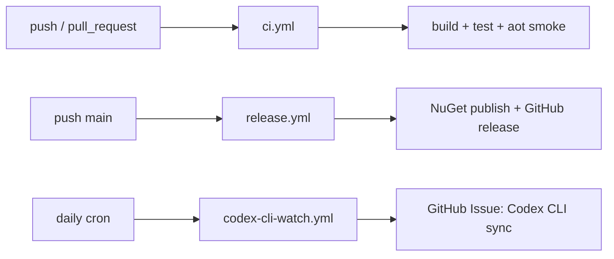

# Feature: Release and Codex CLI Sync Automation

Links:
Architecture: [docs/Architecture/Overview.md](../Architecture/Overview.md)
Modules: [.github/workflows](../../.github/workflows)
ADRs: [001-codex-cli-wrapper.md](../ADR/001-codex-cli-wrapper.md)

---

## Purpose

Keep package quality and upstream Codex CLI parity automatically verified through GitHub workflows.

---

## Scope

### In scope

- CI workflow (`ci.yml`)
- release workflow (`release.yml`)
- CodeQL workflow (`codeql.yml`)
- upstream watch workflow (`codex-cli-watch.yml`)
- real integration matrix workflow (`real-integration.yml`)

### Out of scope

- external deployment environments
- branch protection settings configured outside repository

---

## Business Rules

- CI must run build and tests on every push/PR.
- Release workflow must build/test before pack/publish.
- Release workflow must read package version from `Directory.Build.props`.
- Release workflow must validate semantic version format before packaging.
- Release workflow must use generated GitHub release notes.
- Release workflow must create/push git tag `v<version>` before publishing GitHub release.
- Codex CLI watch runs daily and opens issue when upstream `openai/codex` changed since pinned submodule SHA.
- Sync issue body must include detected candidate changes for CLI flags/models/features and actionable checklist.
- Sync issue must assign Copilot by default.
- Duplicate sync issue for same upstream SHA is not allowed.

---

## Diagrams

---

## Verification

### Test commands

- `dotnet build ManagedCode.CodexSharpSDK.slnx -c Release -warnaserror`
- `dotnet test --solution ManagedCode.CodexSharpSDK.slnx -c Release`
- `dotnet publish tests/AotSmoke/ManagedCode.CodexSharpSDK.AotSmoke.csproj -c Release -r osx-arm64 /p:PublishAot=true`

### Workflow mapping

- CI: [ci.yml](../../.github/workflows/ci.yml)
- Release: [release.yml](../../.github/workflows/release.yml)
- CodeQL: [codeql.yml](../../.github/workflows/codeql.yml)
- CLI Watch: [codex-cli-watch.yml](../../.github/workflows/codex-cli-watch.yml)
- Real integration matrix: [real-integration.yml](../../.github/workflows/real-integration.yml)

---

## Definition of Done

- Workflows are versioned and valid in repository.
- Local commands match CI commands.
- Daily sync issue automation is configured and documented.
