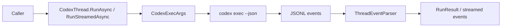

# Feature: CodexThread Run Flow

Links:
Architecture: [docs/Architecture/Overview.md](../Architecture/Overview.md)
Modules: [CodexThread.cs](../../CodexSharpSDK/Client/CodexThread.cs), [CodexExec.cs](../../CodexSharpSDK/Execution/CodexExec.cs), [ThreadEventParser.cs](../../CodexSharpSDK/Internal/ThreadEventParser.cs)
ADRs: [001-codex-cli-wrapper.md](../ADR/001-codex-cli-wrapper.md), [002-protocol-parsing-and-thread-serialization.md](../ADR/002-protocol-parsing-and-thread-serialization.md)

---

## Purpose

Provide deterministic thread-based execution over Codex CLI so C# consumers can run turns, stream events, and resume existing conversations safely.

---

## Scope

### In scope

- Turn execution (`RunAsync`, `RunStreamedAsync`) for plain text and structured inputs.
- Conversion of Codex JSONL stream into typed `ThreadEvent`/`ThreadItem` models.
- CodexThread identity tracking across `thread.started` and `resume` flows.
- Failure/cancellation handling and output schema temp file lifecycle.

### Out of scope

- Network transport reimplementation of Codex protocol (SDK uses CLI process).
- Multi-thread merge semantics between separate `CodexThread` instances.

---

## Business Rules

- Only one active turn per `CodexThread` instance.
- `RunAsync` returns only completed items and latest assistant text as `FinalResponse`.
- `RunAsync<TResponse>` returns `RunResult<TResponse>` with deserialized `TypedResponse`; typed runs require an output schema via either direct `outputSchema` overload parameter or `TurnOptions.OutputSchema`.
- Typed run API supports both concise overloads (`RunAsync<TResponse>(..., outputSchema, ...)`) and full options overloads (`RunAsync<TResponse>(..., turnOptions)`); for AOT-safe typed deserialization pass `JsonTypeInfo<TResponse>`.
- Convenience typed overloads without `JsonTypeInfo<TResponse>` are explicitly marked as AOT-unsafe with `RequiresDynamicCode` and `RequiresUnreferencedCode`.
- `turn.failed` must raise `ThreadRunException`.
- Invalid JSONL event lines must fail fast with parse context.
- Protocol tokens are parsed via constants, not inline literals.
- Parser must support `collab_tool_call` items emitted by multi-agent operations.
- Optional `ILogger` (`Microsoft.Extensions.Logging`) receives process lifecycle diagnostics (start/success/failure/cancellation).
- Structured output uses typed `StructuredOutputSchema` models (including DTO property selectors) that are serialized to CLI JSON schema files.
- `LocalImageInput` accepts image path, `FileInfo`, or `Stream`; stream inputs are materialized to temp files and cleaned after run.
- Codex executable resolution is deterministic: prefer npm-vendored native binary, then PATH lookup; on Windows PATH lookup checks `codex.exe`, `codex.cmd`, `codex.bat`, then `codex`.
- Thread options map full Codex CLI flags (`profile`, `enable/disable`, OSS provider, ephemeral/color/progress/output options), plus raw `AdditionalCliArguments` passthrough for forward-compatible flags.
- If thread web search options are not set, SDK does not emit `web_search` overrides and keeps effective CLI/config setting unchanged.
- Cleanup failures are never silently swallowed; process/schema/image cleanup issues are logged through `ILogger`.

---

## User Flows

### Primary flows

1. Start and run turn
- Actor: SDK consumer
- Trigger: `StartThread().RunAsync(...)`
- Steps: build CLI args -> execute Codex CLI -> parse stream -> collect result
- Result: `RunResult` with items, usage, final assistant response

2. Start and run typed structured turn
- Actor: SDK consumer
- Trigger: `StartThread().RunAsync<TResponse>(..., outputSchema, ...)` (or `TurnOptions` variant)
- Steps: run regular turn -> deserialize final JSON response to `TResponse` using provided `JsonTypeInfo<TResponse>` when needed
- Result: `RunResult<TResponse>` with typed payload in `TypedResponse`

3. Resume existing thread
- Actor: SDK consumer
- Trigger: `ResumeThread(id).RunAsync(...)`
- Steps: include `resume <id>` args before image flags -> parse events
- Result: turn executes in existing Codex conversation

### Edge cases

- Malformed JSON line -> `InvalidOperationException` with raw line context
- `turn.failed` event -> `ThreadRunException`
- cancellation token triggered -> execution interrupted and surfaced to caller

---

## Diagrams

---

## Verification

### Test commands

- build: `dotnet build ManagedCode.CodexSharpSDK.slnx -c Release -warnaserror`
- test: `dotnet test --solution ManagedCode.CodexSharpSDK.slnx -c Release`
- format: `dotnet format ManagedCode.CodexSharpSDK.slnx`
- coverage: `dotnet test --solution ManagedCode.CodexSharpSDK.slnx -c Release -- --coverage --coverage-output-format cobertura --coverage-output coverage.cobertura.xml`

### Test mapping

- CodexThread behavior: [CodexThreadTests.cs](../../CodexSharpSDK.Tests/Unit/CodexThreadTests.cs)
- Protocol parsing: [ThreadEventParserTests.cs](../../CodexSharpSDK.Tests/Unit/ThreadEventParserTests.cs)
- CLI argument mapping: [CodexExecTests.cs](../../CodexSharpSDK.Tests/Unit/CodexExecTests.cs)
- Client lifecycle: [CodexClientTests.cs](../../CodexSharpSDK.Tests/Unit/CodexClientTests.cs)

---

## Definition of Done

- Public thread APIs stay aligned with current Codex CLI contracts and documented in repository feature/architecture docs.
- All listed tests pass.
- AOT publish smoke remains green.
- Docs remain aligned with code and CI workflows.
