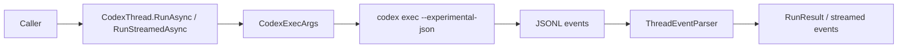

# Feature: CodexThread Run Flow

Links:
Architecture: [docs/Architecture/Overview.md](../Architecture/Overview.md)
Modules: [CodexThread.cs](../../src/CodexSharp/CodexThread.cs), [CodexExec.cs](../../src/CodexSharp/CodexExec.cs), [ThreadEventParser.cs](../../src/CodexSharp/Internal/ThreadEventParser.cs)
ADRs: [001-codex-cli-wrapper.md](../ADR/001-codex-cli-wrapper.md), [002-protocol-parsing-and-thread-serialization.md](../ADR/002-protocol-parsing-and-thread-serialization.md)

---

## Purpose

Provide deterministic thread-based execution over Codex CLI so C# consumers can run turns, stream events, and resume existing conversations safely.

---

## Scope

### In scope

- Turn execution (`RunAsync`, `RunStreamedAsync`) for plain text and structured inputs.
- Conversion of Codex JSONL stream into typed `ThreadEvent`/`ThreadItem` models.
- CodexThread identity tracking across `thread.started` and `resume` flows.
- Failure/cancellation handling and output schema temp file lifecycle.

### Out of scope

- Network transport reimplementation of Codex protocol (SDK uses CLI process).
- Multi-thread merge semantics between separate `CodexThread` instances.

---

## Business Rules

- Only one active turn per `CodexThread` instance.
- `RunAsync` returns only completed items and latest assistant text as `FinalResponse`.
- `turn.failed` must raise `ThreadRunException`.
- Invalid JSONL event lines must fail fast with parse context.
- Protocol tokens are parsed via constants, not inline literals.

---

## User Flows

### Primary flows

1. Start and run turn
- Actor: SDK consumer
- Trigger: `StartThread().RunAsync(...)`
- Steps: build CLI args -> execute Codex CLI -> parse stream -> collect result
- Result: `RunResult` with items, usage, final assistant response

2. Resume existing thread
- Actor: SDK consumer
- Trigger: `ResumeThread(id).RunAsync(...)`
- Steps: include `resume <id>` args before image flags -> parse events
- Result: turn executes in existing Codex conversation

### Edge cases

- Malformed JSON line -> `InvalidOperationException` with raw line context
- `turn.failed` event -> `ThreadRunException`
- cancellation token triggered -> execution interrupted and surfaced to caller

---

## Diagrams

---

## Verification

### Test commands

- build: `dotnet build CodexSharp.slnx -c Release -warnaserror`
- test: `dotnet test --solution CodexSharp.slnx -c Release`
- format: `dotnet format CodexSharp.slnx`
- coverage: `dotnet test --solution CodexSharp.slnx -c Release -- --coverage --coverage-output-format cobertura --coverage-output coverage.cobertura.xml`

### Test mapping

- CodexThread behavior: [CodexThreadTests.cs](../../tests/CodexSharp.Tests/CodexThreadTests.cs)
- Protocol parsing: [ThreadEventParserTests.cs](../../tests/CodexSharp.Tests/ThreadEventParserTests.cs)
- CLI argument mapping: [CodexExecTests.cs](../../tests/CodexSharp.Tests/CodexExecTests.cs)
- Client lifecycle: [CodexClientTests.cs](../../tests/CodexSharp.Tests/CodexClientTests.cs)

---

## Definition of Done

- Public thread APIs keep TypeScript parity documented in [PORTING_TODO.md](../../PORTING_TODO.md).
- All listed tests pass.
- AOT publish smoke remains green.
- Docs remain aligned with code and CI workflows.
